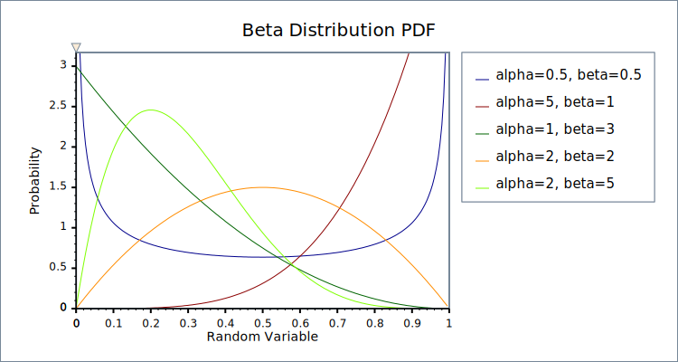
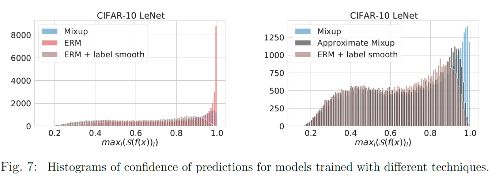
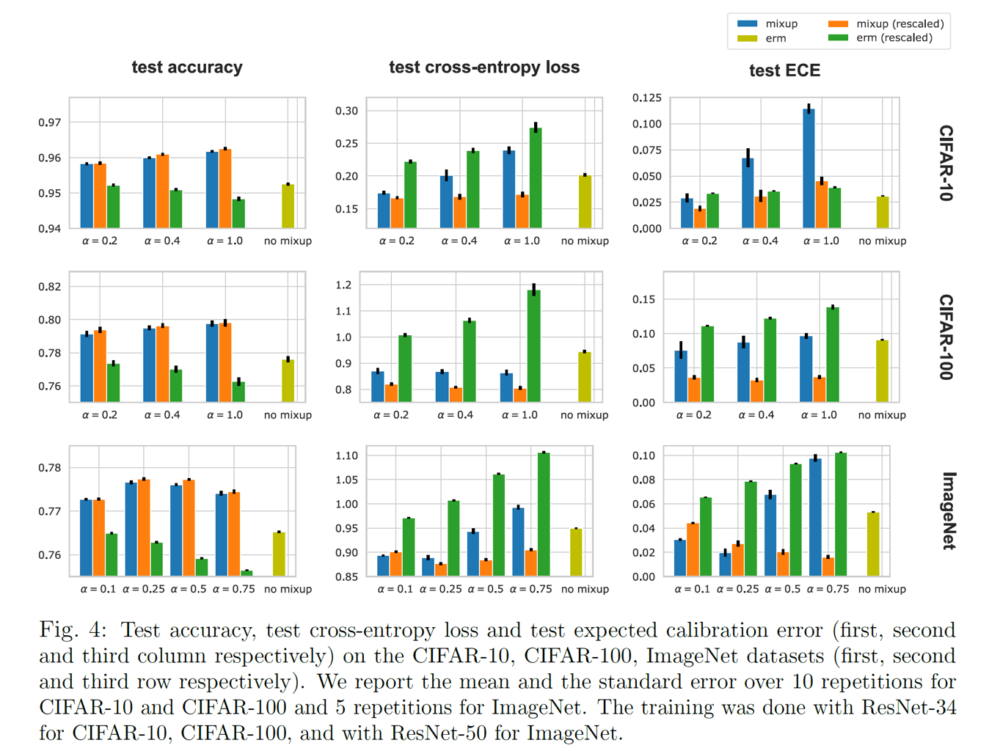
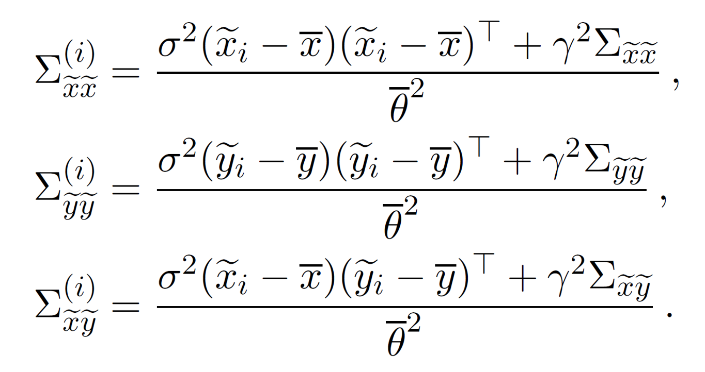
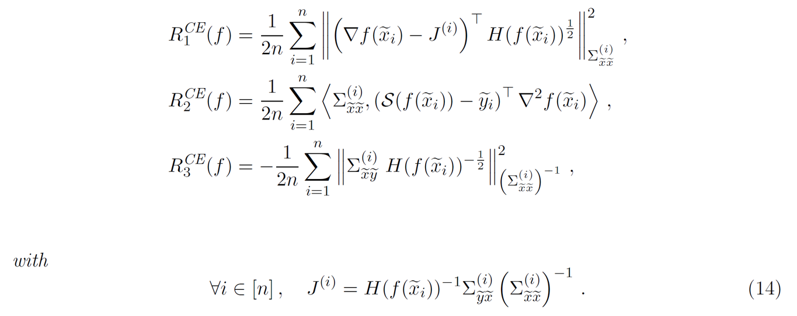
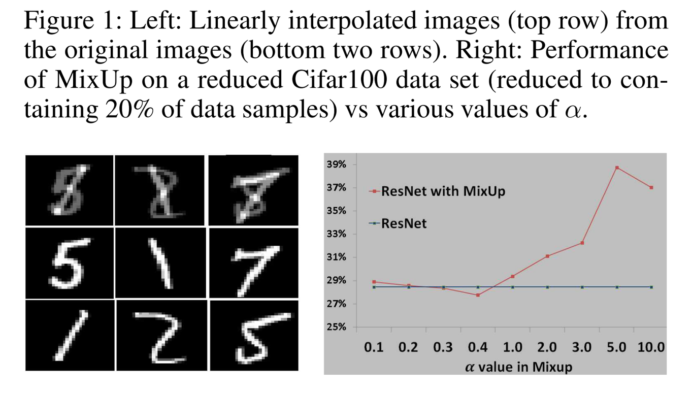
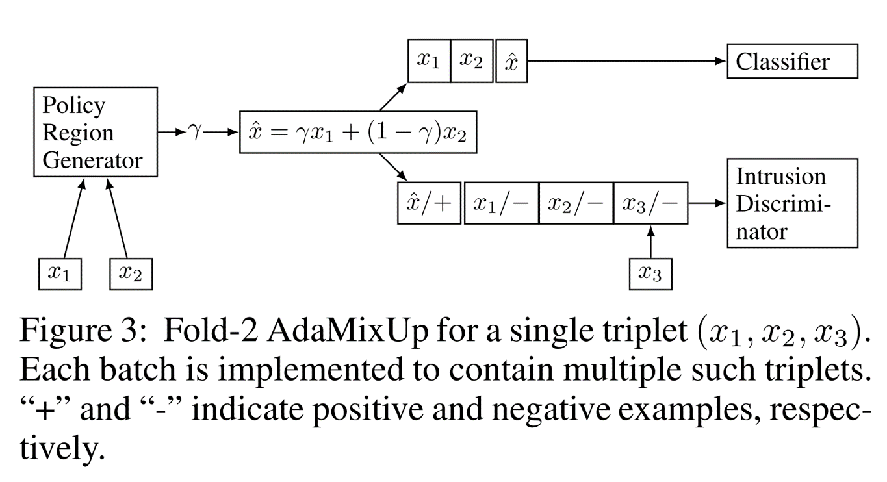
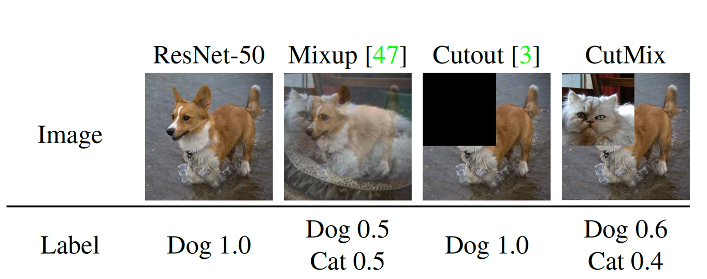
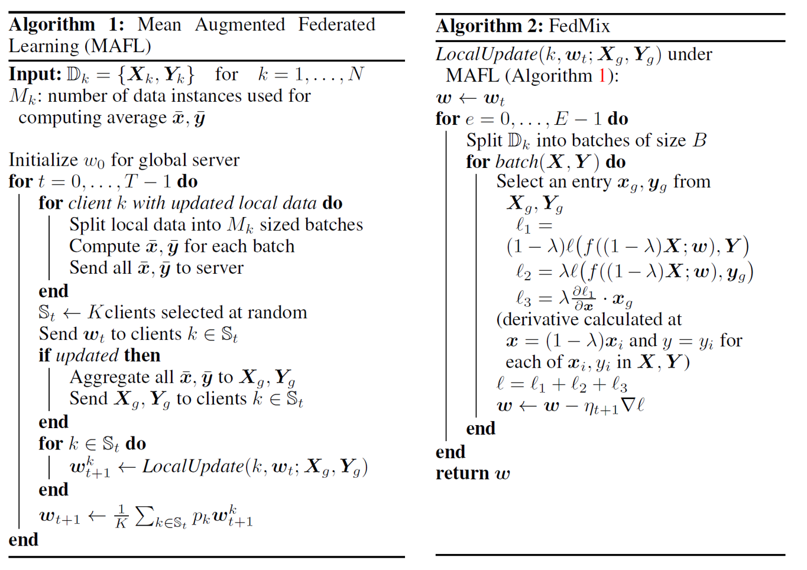

* content
{:toc}

**Mixup** [1]是ICLR2017年提出的针对计算机视觉的一项简单的数据增广策略。通过对输入数据进行简单的线性变换（即$$\tilde{X}=\lambda*X_0+(1-\lambda)*X_1$$）,可以增加模型的泛化能力，并且能够提高模型对于对抗攻击(Adversarial Attack)的鲁棒性。笔者同时发现，采用**Mixup** 技术在各种半监督与类半监督任务上（如半监督学习，无监督域迁移等）都能极大提高模型的泛化能力，在某些任务上甚至达到了*State-of-the-Art*的结果。然而，对于**Mixup**为什么能够提高泛化能力，以及为什么能够有对对抗攻击的鲁棒性，现有研究仍然没有给出好的解释。在本篇Blog中，我将搜集现有对**Mixup**进行理论解释的文章，并对这些方法进行综述式叙述。此外，我也将对现有的**Mixup**策略进行综述。

但是，笔者对现有的理论研究并不抱有赞成态度。几乎所有的理论研究套路都是令$$1-\lambda\rightarrow 0$$，此时**Mixup**策略中的第二项，即$$(1-\lambda)*X_1$$这一项几乎是微小扰动。现有理论研究都是在这种近似基础上采用泰勒分解，并得出一些结论。但是，在笔者自己所做的实验中，在大部分半监督场景下，当$$\lambda$$的取值在$$0.5$$附近时，如$$\lambda\sim\beta(2,2)$$，模型泛化能力会提高一个台阶（如在DomainNet上相对于$$\lambda\sim\beta(0.2,0.2)$$的分布会提高4-5个点）。对于这种现象，现有所有的理论似乎都失效了，这也是值得研究的一个点。

## Mixup的介绍与理论分析

**Mixup**是一种数据增广策略，通过对模型输入与标签构建具有“凸”性质的运算，构造新的训练样本与对应的标签，提高模型的泛化能力。对于具有层次特征的深度学习模型$$\mathbf{h}=f_{m}\circ \cdots \circ f_{1}\circ f_{0}(\mathbf{X})$$，广义的**Mixup**[1,2]策略将任意层的特征以及对应的标签进行混合，并构造损失函数如下：

**Definition 1.** 对于任意两组输入-标签对$$(\mathbf{X}_i,\mathbf{y}_i)$$以及$$(\mathbf{X}_j,\mathbf{y}_j)$$，令$$\mathbf{h}^{k}_i,\mathbf{h}^{k}_j$$为$$\mathbf{X}_i,\mathbf{X}_j$$所对应的第$k$层输入特征（注意到第0层输入特征是原始输入，即$$\mathbf{h}^0=\mathbf{X}$$），则**Mixup**方法可以描述为 
$$
\begin{cases}
\tilde{\mathbf{h}}^{k}(\lambda) = \lambda*\mathbf{h}^{k}_i+(1-\lambda)*\mathbf{h}^{k}_j
\\
\tilde{\mathbf{y}}(\lambda)= \lambda*\mathbf{y}_i+(1-\lambda)*\mathbf{y}_j
\\
\text{L}_{mixup}(f_m\circ\cdots\circ f_{k},\mathbf{X}_i,\mathbf{y}_i,\mathbf{X}_j,\mathbf{y}_j)=\text{dist}(f_m\circ\cdots\circ f_{k}(\tilde{\mathbf{h}}^{k}(\lambda)),\tilde{\mathbf{y}}(\lambda)) 
\end{cases}
\tag{0}
$$

其中，$$\text{dist}$$函数可以用多种距离计算，如**norm-2**距离$$\Vert\cdot\Vert_2^2$$以及KL散度，而模型$$f_m\circ\cdots\circ f_{k}$$通过损失函数$$\text{L}_{mixup}$$计算梯度，通过梯度下降法进行更新。

大部分论文 [3]将**Mixup**方法视作一种*data-dependent*的正则化操作，即要求模型在特征层面对于运算满足线性约束，利用这种约束对模型施加正则化。但是，相比于其他的数据增广策略，**Mixup**还对标签空间进行了软化，其目标函数往往并不是**one-hot**的对象，而是一组概率。此外，**Mixup**并不需要刻意挑选融合的对象，就算是对输入的猫狗进行加权相加，得到看似毫无意义的输入数据以及对应的标签，都能对模型起到良好的引导。近来的工作还发现**Mixup**对于对抗攻击具有良好的鲁棒性，这些特性使得**Mixup**成为一个需要独立研究的对象。

在笔者自己的实验中，**Mixup**，**Label-smoothing**，**Knowledge** **distillation**这些概念往往在实践中都有千丝万缕的联系，它们的共同特点都是对标签空间进行了合理的“软化”。鉴于**Mixup**已经是我的常用涨点trick之一，对它进行全面的理论分析（然后看看能不能水文章）自然义不容辞。在本节中，我将以近年来Mixup上理论分析做的最深入的文献**On Mixup Regularization**[4]作为基础，对**Mixup**背后的理论进行介绍。

正则化（Regularization）是深度学习中模型训练成功的关键。现有的正则化方法分为两种，一种是直接对模型施加显式的正则化约束，或者是利用数据增广的方法，通过数据层面对模型施加隐式正则化约束。显式的正则化约束包括：（1）对于参数施加惩罚，比如$$L_1,L_2$$正则化项，这往往在程序中采用*weight decay*的方法进行实现。（2）对于神经网络的表示空间（representation space）或是输出施加扰动或噪声，比如随机dropout，或分块dropout。（3）对于输出进行正则化，比如batch normalization，residual learning，或者是label smoothing（可以增加精度）。隐式正则化约束包括：（1）模型参数的共用（比如从全连接到CNN，出现了filter模块）。（2）优化算法的选择（比如SGD，Adam）。（3）数据增广方法。一般而言，显式的正则化帮助模型在鲁棒性与预测精度上取得优势，而隐式的正则化则增加模型的泛化性。一般而言，隐式正则化与显式正则化方法具有某种等效性，比如对数据施加噪声等价于岭回归$$(\mathbf{X}^T\mathbf{X}+\lambda \mathbf{I})^{-1}$$。此外，Dropout方法也与$$L_2$$正则化具有等价性。大量实验表明，**Mixup**方法可以提高模型对于对抗攻击的鲁棒性，同样可以提高模型的泛化能力和预测精度（ECE损失），但是它的原理却较难理解。一个很自然的想法是，**Mixup**能达成其他的正则化方法的优点，那么它们必然具有一定的等价性，将**Mixup**通过形式变换，如果能与其他正则化方法构建等价形式，就能够从理论上解释**Mixup**的作用。**On Mixup Regularization**[4]利用泰勒展开，将**Mixup**与*label-smoothing*，*Lipschitz*正则化，输入标准化（如$$\mathbf{X}-\bar{\mathbf{X}}$$)以及对输入的随机扰动(random perturbation)建立联系，对于**Mixup**进行理论分析。

###  基于模型正则化的理论分析

首先看**On Mixup Regularization**[4]的第一个定理。

**Theorem 1.** 对于**C**分类问题，记神经网络的输出为$$\mathbf{h}$$，标签为$$\mathbf{y}$$，基于*logsoftmax*的交叉熵损失为$$l(\mathbf{y},\mathbf{h})=\log{\sum_{i=1}^{C}\exp(\mathbf{h}_i)}-\mathbf{y}^T\mathbf{h}$$，对于有**N**个样本的训练集$$S=\{(\mathbf{X}_1,\mathbf{y}_1),\cdots,(\mathbf{X}_n,\mathbf{y}_n)\}$$，考虑随机变量$$\theta\sim\beta_{[\frac{1}{2},1]}(\alpha,\alpha),j\sim\text{Unif}([N])$$，基于**Mixup**方法的损失函数可以等价推导出如下形式：

$$
\xi^{\text{mixup}}(f)=\frac{1}{N}\sum_{i=1}^{N}\mathbb{E}_{\theta,j}l(\tilde{\mathbf{y_i}}+\epsilon_i,f(\tilde{\mathbf{X}}_i+\delta_i)) \tag{1}
$$

其中，$\tilde{\mathbf{y_i}},\epsilon_i,\tilde{\mathbf{X}}_i,\delta_i$满足

$$
\begin{cases}
\tilde{\mathbf{X}}_i=\bar{\mathbf{X}}+\bar{\theta}(\mathbf{X}_i-\bar{\mathbf{X}});\\
\tilde{\mathbf{y_i}}=\bar{\mathbf{y}}+\bar{\theta}(\mathbf{y}_i-\bar{\mathbf{y}});\\
\delta_i=(\theta-\bar{\theta})\mathbf{X}_i+(1-\theta)\mathbf{X}_j-(1-\bar{\theta})\bar{\mathbf{X}};\\
\epsilon_i = (\theta-\bar{\theta})\mathbf{y}_i+(1-\theta)\mathbf{y}_j-(1-\bar{\theta})\bar{\mathbf{y}}.
\end{cases}
$$

它的推断流程如下所述：

对于有**N**个样本的训练集$$S=\{(\mathbf{X}_1,\mathbf{y}_1),\cdots,(\mathbf{X}_n,\mathbf{y}_n)\}$$，令$$\lambda\sim\beta_{[0,1]}(\alpha,\alpha)$$，基于**Mixup**方法的经验损失函数 (empirical risk)为

$$
\xi^{\text{mixup}}(f)=\frac{1}{N^2}\sum_{i=1}^{N}\sum_{j=1}^{N}\mathbb{E}_{\lambda}l(\lambda\mathbf{y_i}+(1-\lambda)\mathbf{y_j},f(\lambda\mathbf{X_i}+(1-\lambda)\mathbf{X_j})) \tag{2}
$$

考虑$$\lambda$$的几个可能的分布函数（只需要观察$$\alpha=0.5,2$$的两种可能性）：

一般而言，**Mixup**方法普遍选择$$\alpha=0.2,0.5$$，这也就意味着$$\lambda$$呈现对称分布，且分布值集中于$$0,1$$两头，这就意味着，在公式$$(2)$$中出现的$$\lambda\mathbf{y_i}+(1-\lambda)\mathbf{y_j}$$中，前面系数较小的一项可以看作是额外的扰动项，根据这个思路，我们可以将$$(2)$$拆分为主要项和扰动项，思路如下所述。首先，记

$$
m_{i,j}(\lambda)=l(\lambda\mathbf{y_i}+(1-\lambda)\mathbf{y_j},f(\lambda\mathbf{X_i}+(1-\lambda)\mathbf{X_j}))
$$

记$$\lambda=\pi\lambda_0+(1-\pi)\lambda_1,\lambda_0\sim\beta_{[0,\frac{1}{2}]}(\alpha,\alpha),\lambda_1\sim\beta_{[\frac{1}{2},1]}(\alpha,\alpha),\pi\sim\text{Ber}(\frac{1}{2})$$,那么$$(2)$$式可以写成

$$
\mathbb{E}_{\lambda}m_{i,j}(\lambda)=\mathbb{E}_{\lambda_0,\lambda_1,\pi}m_{i,j}(\pi\lambda_0+(1-\pi)\lambda_1)\\
=\frac{1}{2}[\mathbb{E}_{\lambda_0}m_{i,j}(\lambda_0)+\mathbb{E}_{\lambda_1}m_{i,j}(\lambda_1)]
$$

注意到$$\lambda_1=1-\lambda_0$$，因此$$\mathbb{E}_{\lambda_0}m_{i,j}(\lambda_0)=\mathbb{E}_{\lambda_1}m_{j,i}(\lambda_1)$$,代入到$$(2)$$中，我们有：

$$
\xi^{\text{mixup}}(f)=\frac{1}{2N^2}\sum_{i=1}^{N}\sum_{j=1}^{N}[\mathbb{E}_{\lambda_1}m_{j,i}(\lambda_1)+\mathbb{E}_{\lambda_1}m_{i,j}(\lambda_1)]\tag{3}
$$

注意到在有限样本下，$$i,j$$的顺序可以调换，因此$$(3)$$写作

$$
\xi^{\text{mixup}}(f)=\frac{1}{N^2}\sum_{i=1}^{N}\sum_{j=1}^{N}\mathbb{E}_{\lambda_1}m_{i,j}(\lambda_1)\\=\frac{1}{N}\sum_{i=1}^N[\frac{1}{N}\sum_{j=1}^{N}\mathbb{E}_{\lambda_1}m_{i,j}(\lambda_1)]
$$

记$$l_i =\frac{1}{N}\sum_{j=1}^{N}\mathbb{E}_{\lambda_1}m_{i,j}(\lambda_1)$$,可以展开为

$$
l_i=\mathbb{E}_{\theta,j}l(\theta \mathbf{y_i}+(1-\theta)\mathbf{y_j},f(\theta\mathbf{X_i}+(1-\theta)\mathbf{X_j}))
$$

此外，注意到

$$
\mathbb{E}_{\theta,j}[\theta \mathbf{y_i}+(1-\theta)\mathbf{y_j}]=\bar{\mathbf{y}}+\bar{\theta}(\mathbf{y}_i-\bar{\mathbf{y}})\\
\mathbb{E}_{\theta,j}[\theta \mathbf{X_i}+(1-\theta)\mathbf{X_j}]=\bar{\mathbf{X}}+\bar{\theta}(\mathbf{X}_i-\bar{\mathbf{X}}) \tag{4}
$$

通过这个变化，我们成功将$$\mathbf{y_j},\mathbf{X_j}$$这一项消除了，并藏在了均值中。因此，对$$l_i$$的一个简单的变换为

$$
\epsilon_i = \theta \mathbf{y_i}+(1-\theta)\mathbf{y_j}-\mathbb{E}_{\theta,j}[\theta \mathbf{y_i}+(1-\theta)\mathbf{y_j}];\\
\delta_i=\theta \mathbf{X_i}+(1-\theta)\mathbf{X_j}-\mathbb{E}_{\theta,j}[\theta \mathbf{X_i}+(1-\theta)\mathbf{X_j}];\\
\tilde{\mathbf{y_i}}=\bar{\mathbf{y}}+\bar{\theta}(\mathbf{y}_i-\bar{\mathbf{y}});\\
\tilde{\mathbf{X}}_i=\bar{\mathbf{X}}+\bar{\theta}(\mathbf{X}_i-\bar{\mathbf{X}});\\
l_i=l(\tilde{\mathbf{y_i}}+\epsilon_i,f(\tilde{\mathbf{X}}_i+\delta_i))
$$

这就得到了Theorem 1中的等价形式$$(1)$$。 根据这个等价形式，我们可以看到，**Mixup**策略可以看成是一种向着均值空间的收缩，即将原来的空间$$\mathcal{X,Y}$$通过$(4)$变换到另外一个空间$$\tilde{\mathcal{X}},\tilde{\mathcal{Y}}$$，在变换的过程中，采用一个范围为$$[\frac{1}{2},1]$$的系数进行压缩，如果$$\alpha=2,4$$，这个压缩系数会在$$0.6$$附近，压缩的程度比较大；而如果$$\alpha=0.2,0.5$$，这个压缩系数则会在$$0.9$$附近，等价于中心化。对于标签空间$$\mathcal{Y}$$而言，这种方法等价于**label-smooth**，在实验中，这种变换会使得预测的结果不至于太大。实验结果表明，在进行**Mixup**或**label-smooth**后，模型预测的最大概率$$\mathbf{p}$$的分布变小了，极限情况（如$$\mathbf{p}=1.0$$）也变小了。

此外，注意到在训练过程中，对于训练数据进行了变换，那么同样在测试过程中也应当进行相似的变换，即在输入的时候，应当将$$\mathbf{X}_{\text{test}}$$先变换进$$\tilde{\mathcal{X}}$$空间，即$$\tilde{\mathbf{X}}_{\text{test}}=\bar{\mathbf{X}}+\bar{\theta}(\mathbf{X}_{\text{test}}-\bar{\mathbf{X}})$$。得到模型对$$\tilde{\mathbf{X}}_{\text{test}}$$的预测$$\tilde{\mathbf{y}}_{\text{test}}$$之后，再将其变换到真实标注空间$$\tilde{\mathcal{Y}}$$，即$$\text{pred}_{f}(\mathbf{X}_{\text{test}})=\frac{1}{\bar{\theta}}(\tilde{\mathbf{y}}-\bar{\mathbf{y}})+\bar{\mathbf{y}}$$。**On Mixup Regularization**[4]发现，这种变换能够显著提高使用**Mixup**进行训练的模型的精度和准确性，并且精度的评估指标**ECE**也上升了。

到此，我们从靠近均值的中心化变换（space transform）以及标签平滑化（label-smooth）两个角度对**Mixup**进行了研究。注意到我们在式$$(1)$$中还引入了残差项$$\epsilon_i,\delta_i$$，显然，它们的期望为0，并且当$$\theta \rightarrow 1$$的时候，它们的取值范围也不会离0很远。因此，我们在$$\alpha=0.2,0.5$$这种条件下，将这些残差项视作微小扰动，通过泰勒展开研究**Mixup**在噪声正则化上的效果。

先回顾在$$(\tilde{\mathbf{X}},\tilde{\mathbf{y}})$$附近的二阶(Quadric)泰勒展开公式：

$$
G_{Q}(\tilde{\mathbf{X}}+\delta,\tilde{\mathbf{y}}+\epsilon)=G(\tilde{\mathbf{X}},\tilde{\mathbf{y}})+\nabla_{\tilde{\mathbf{X}}}G(\tilde{\mathbf{X}},\tilde{\mathbf{y}})\delta+\nabla_{\tilde{\mathbf{y}}}G(\tilde{\mathbf{X}},\tilde{\mathbf{y}})\epsilon+\frac{1}{2}\delta^T\nabla_{\tilde{\mathbf{X}}\tilde{\mathbf{X}}}^2G(\tilde{\mathbf{X}},\tilde{\mathbf{y}})\delta\\+\frac{1}{2}\epsilon^T\nabla_{\tilde{\mathbf{y}}\tilde{\mathbf{y}}}^2G(\tilde{\mathbf{X}},\tilde{\mathbf{y}})\epsilon+\epsilon^T\nabla_{\tilde{\mathbf{X}}\tilde{\mathbf{y}}}^2G(\tilde{\mathbf{X}},\tilde{\mathbf{y}})\delta+\Delta(\delta,\epsilon)
$$

注意到$$\forall i\in[N],\mathbb{E}_{\theta,j}\delta_i=0,\mathbb{E}_{\theta,j}\epsilon_i=0$$，因此在$$\mathbb{E}_{\theta,j}l_{Q}(\tilde{\mathbf{y_i}}+\epsilon_i,f(\tilde{\mathbf{X}}_i+\delta_i))$$的二阶泰勒展开中，它们的一阶导数都可以忽略，此时我们利用泰勒公式将损失函数$$\xi^{\text{mixup}}(f)$$写成

$$
\mathbb{E}_{\theta,j}l_{Q}(\tilde{\mathbf{y_i}}+\epsilon_i,f(\tilde{\mathbf{X}}_i+\delta_i))=l(\tilde{\mathbf{y_i}},f(\tilde{\mathbf{X}}_i))+\frac{1}{2}\langle{\mathbb{E}_{\theta,j}\delta_i\delta_i^T,\nabla_{\tilde{\mathbf{X}}\tilde{\mathbf{X}}}^2G(\tilde{\mathbf{X}},\tilde{\mathbf{y}})}\rangle\\
+\frac{1}{2}\langle{\mathbb{E}_{\theta,j}\epsilon_i\epsilon_i^T,\nabla_{\tilde{\mathbf{y}}\tilde{\mathbf{y}}}^2G(\tilde{\mathbf{X}},\tilde{\mathbf{y}})}\rangle+\langle{\mathbb{E}_{\theta,j}\epsilon_i\delta_i^T,\nabla_{\tilde{\mathbf{y}}\tilde{\mathbf{X}}}^2G(\tilde{\mathbf{X}},\tilde{\mathbf{y}})}\rangle
$$

注意到，这里利用的结论为

$$
\mathbf{u}\in \mathbb{R}^{m\times 1},\mathbf{v}\in \mathbb{R}^{n\times 1},\mathbf{X}\in \mathbb{R}^{m\times n};\mathbf{u^TXv}=\langle \mathbf{uv^T},\mathbf{X}\rangle
$$

其中，$$\langle \mathbf{uv^T},\mathbf{X}\rangle$$表示把矩阵按行拉平，然后做内积，我们利用这个结论把$$\delta^T\nabla_{\tilde{\mathbf{X}}\tilde{\mathbf{X}}}^2G(\tilde{\mathbf{X}},\tilde{\mathbf{y}})\delta$$写成为$$\langle{\delta_i\delta_i^T,\nabla_{\tilde{\mathbf{X}}\tilde{\mathbf{X}}}^2G(\tilde{\mathbf{X}},\tilde{\mathbf{y}})}\rangle$$，同理可得后面两项，然后再将期望代入。此外，我们还要利用以下三条公式：

$$
\frac{\partial l(\tilde{\mathbf{y_i}},f(\tilde{\mathbf{X}}_i))}{\partial_{\tilde{\mathbf{X}}_i}}=\nabla_{\mathbf{h_i}}l(\tilde{\mathbf{y_i}},f(\tilde{\mathbf{X}}_i))\nabla f(\tilde{\mathbf{X}}_i)\\
\nabla_{\tilde{\mathbf{X}}_i\tilde{\mathbf{X}}_i}^2l(\tilde{\mathbf{y_i}},f(\tilde{\mathbf{X}}_i))=\nabla f(\tilde{\mathbf{X}}_i)^{T}\nabla_{\mathbf{h_i}}l(\tilde{\mathbf{y_i}},f(\tilde{\mathbf{X}}_i))\nabla f(\tilde{\mathbf{X}}_i)+\nabla_{\mathbf{h_i}}l(\tilde{\mathbf{y_i}},f(\tilde{\mathbf{X}}_i))\nabla^2 f(\tilde{\mathbf{X}}_i)\\
\nabla_{\tilde{\mathbf{y}}_i\tilde{\mathbf{X}}_i}^2l(\tilde{\mathbf{y_i}},f(\tilde{\mathbf{X}}_i))=\nabla_{\tilde{\mathbf{y}_i},\mathbf{h_i}}l(\tilde{\mathbf{y_i}},f(\tilde{\mathbf{X}}_i))\nabla f(\tilde{\mathbf{X}}_i)
$$

此外，我们记

$$
\mathbb{E}_{\theta,j}\delta_i\delta_i^T=\Sigma_{\tilde{\mathbf{X}}\tilde{\mathbf{X}}}^{(i)};\mathbb{E}_{\theta,j}\epsilon_i\epsilon_i^T=\Sigma_{\tilde{\mathbf{y}}\tilde{\mathbf{y}}}^{(i)};\mathbb{E}_{\theta,j}\epsilon_i\delta_i^T=\Sigma_{\tilde{\mathbf{y}}\tilde{\mathbf{X}}}^{(i)}
$$

注意

$$
\delta_i=(\theta-\bar{\theta})(\mathbf{X}_i-\bar{\mathbf{X}})+(1-\theta)(\mathbf{X}_j-\bar{\mathbf{X}});\\
\epsilon_i = (\theta-\bar{\theta})(\mathbf{y}_i-\bar{\mathbf{y}})+(1-\theta)(\mathbf{y}_j-\bar{\mathbf{y}})
$$

容易得到

$$
\mathbb{E}_{\theta,j}\delta_i\delta_i^T=\text{Var}(\theta)(\mathbf{X}_i-\bar{\mathbf{X}})(\mathbf{X}_i-\bar{\mathbf{X}})^T+\mathbb{E}_{\theta}(1-\theta)^2\Sigma_{\mathbf{X}\mathbf{X}};\\
\mathbb{E}_{\theta,j}\epsilon_i\epsilon_i^T=\text{Var}(\theta)(\mathbf{y}_i-\bar{\mathbf{y}})(\mathbf{y}_i-\bar{\mathbf{y}})^T+\mathbb{E}_{\theta}(1-\theta)^2\Sigma_{\mathbf{y}\mathbf{y}};\\
\mathbb{E}_{\theta,j}\epsilon_i\delta_i^T=\text{Var}(\theta)(\mathbf{X}_i-\bar{\mathbf{X}})(\mathbf{y}_i-\bar{\mathbf{y}})^T+\mathbb{E}_{\theta}(1-\theta)^2\Sigma_{\mathbf{X}\mathbf{y}}
$$

此外，注意到

$$
\begin{cases}
\tilde{\mathbf{X}}_i=\bar{\mathbf{X}}+\bar{\theta}(\mathbf{X}_i-\bar{\mathbf{X}});\\
\tilde{\mathbf{y_i}}=\bar{\mathbf{y}}+\bar{\theta}(\mathbf{y}_i-\bar{\mathbf{y}})
\end{cases}
$$

因此，我们可以利用这个关系，将$$(\mathbf{X},\mathbf{y})$$映射到$$(\tilde{\mathbf{X}},\tilde{\mathbf{y}})$$，此时有$$\Sigma_{\tilde{\mathbf{X}}\tilde{\mathbf{y}}}=\bar{\theta}^2\Sigma_{\mathbf{X}\mathbf{y}}$$，其他情况也可以依次类推，可以得到如下关系：

其中，$$\sigma^2=\text{Var}(\theta),\gamma^2=\sigma^2+(1-\bar{\theta})^2$$。

利用上述关系，**On Mixup Regularization**[4]给出了如下的定理二用以解释**Mixup**方法的影响

注意，$$R_1(f)$$表示基于*Jacobian*正则化的约束。联系Dropout等价于惩罚$$\nabla f$$在训练点的二范数，**Mixup**方法通过对模型梯度与*Jacobian*矩阵的距离进行惩罚来增加模型的泛化性，而这种惩罚并不是直接赋予的，而是通过令模型模仿在输入和标注空间中的线性关系，从而间接施加约束。此外，我们也注意到，**Mixup**的正则化效果也与输出和输出之间的相关性有关，这也解释了单独对输入或者标签进行**Mixup**的效果比起标准的**Mixup**弱很多。

对于交叉熵损失$$l(\mathbf{y},\mathbf{h})=\log{\sum_{i=1}^{C}\exp(\mathbf{h}_i)}-\mathbf{y}^T\mathbf{h}$$，我们记$$S(\mathbf{h})_i=\exp(\mathbf{h}_i)/\sum_{j=1}^{C}\exp(\mathbf{h}_j)$$，并令

$$
H(\mathbf{h})=\text{diag}(S(\mathbf{h}))-S(\mathbf{h})S(\mathbf{h})^T\in \mathbb{R}^{C\times C}
$$

此时在交叉熵损失下的二阶泰勒展开为

$$
\xi^{\text{mixup}}_{Q}(f)=\frac{1}{N}\sum_{i=1}^{N}l^{\text{CE}}(\tilde{\mathbf{y_i}},f(\tilde{\mathbf{X}}_i))+R_1^{\text{CE}}(f)+R_2^{\text{CE}}(f)+R_3^{\text{CE}}(f)
$$

其中

注意到，如果预测概率$$S(\mathbf{h})_i$$过大，如最大的概率接近于1，最小的概率接近于0，那么$$H(\mathbf{h})$$中所有的项都会趋向于0，那么正则化效果就会消失，因此对于标签空间也进行**Mixup**可以防止预测过于自信，从而确保正则化有用，这就解释了为什么只对输入进行**Mixup**效果差，这是因为没有类似于*label-smoothing*的作用，**Mixup**的正则化效果消失了。

### 基于流形学习的理论分析

**Manifold Mixup**[2] 提出了上述公式$$(0)$$中所述的流形学习策略，相对应的，它将目标损失函数写成

$$
\xi^{\text{mixup}}(f)=\inf_{\mathbf{h}_0^k,\cdots,\mathbf{h}_{N}^{k}\in \mathcal{H}}\frac{1}{N(N-1)}\sum_{i,j=1;i\neq j}^{N}\inf_{f}\int_{0}^{1}\text{dist}(f_m\circ\cdots\circ f_{k}(\tilde{\mathbf{h}}^{k}(\lambda),\tilde{\mathbf{y}}(\lambda))d\lambda \tag{5}
$$

**Manifold Mixup**中的核心结论是，只要进行**mixup**的特征空间$$\mathcal{H}$$的维数大于$$C-1$$，那么我们就可以找到一个线性函数$$f_m\circ\cdots\circ f_{k}(\mathbf{h})=\mathbf{A}^T\mathbf{h}+\mathbf{b}$$，以及一个深度表征映射$$h=f_{k-1}\circ\cdots\circ f_{0}(\mathbf{X})$$，令目标损失函数为0。它的证明方法很简单，因为$$\text{dim}(\mathcal{H})\geq C-1$$，所以一定存在一个从$$\mathcal{H}$$到分类空间的映射，简单而言，存在$$\mathbf{A,H}\in\mathbb{R}^{\text{dim}(\mathcal{H}\times C)}$$，使得$$\mathbf{A}^T\mathbf{H}+\mathbf{b}\mathbf{1}_C^{T}=\mathbf{I}_{C\times C}$$。那么，我们只需要对于每一个属于第$$c$$类的样本$$\mathbf{X}_i$$，满足$$\mathbf{h}_i$$为矩阵$$\mathbf{H}$$的第$$c$$列就可以了，这样$$\mathbf{A}^T\mathbf{h}_i+\mathbf{b}\mathbf{1}_C^{T}=\mathbf{y}_i$$，此时目标损失函数$$\xi^{\text{mixup}}(f)=0$$。

**Manifold Mixup**[2] 又指出，在这种条件下，所有数据点在表征空间（representation space）上都会落在一个维数为$$\text{dim}(\mathcal{H})-C+1$$的子流形上。这当然也很好理解，此时$$\mathbf{H}$$上的大部分表达都与$$C$$分类结果建立了联系，剩下的自由维数自然只有$$\text{dim}(\mathcal{H})-C+1$$维。然后**Manifold Mixup**[2] 得到了如下结论：首先，当**Mixup**损失函数$$\xi^{\text{mixup}}(f)$$最小为0时，所有数据的表征都在一个维数为$$\text{dim}(\mathcal{H})-C+1$$的子流形上，因此**Mixup**损失函数鼓励模型学习有效的分类表征。如果$$\text{dim}(\mathcal{H})=C-1$$，那么所有的数据都会映射到同一个点，这个点代表数据的分类。

但是，笔者觉得**Manifold Mixup**的这一套说辞陷入了一个奇怪的逻辑循环。作者认为，当**Mixup**损失函数$$\xi^{\text{mixup}}(f)$$最小为0时，所有数据的表征都在一个维数为$$\text{dim}(\mathcal{H})-C+1$$的子流形上，因此证明了**Mixup**的正则化效果。但是上面的证明方式说明的是，如果我们能将所有的输入数据都按照它们对应的标签整齐地映射到$$\mathbf{H}$$中，此时**Mixup**损失函数为0，这并不能说明**Mixup**的正则化效果。实际上，对于任何一个分类问题，本质上都是学习一种**整齐的映射**。我们都希望神经网络能够学到将同一类数据映射到同一个表征上的能力，而表征和分类的对应关系学习则非常简单。因此，整个分类问题的关键应该是如何学到一个映射，能够将每一个属于第$$c$$类的样本$$\mathbf{X}_i$$，满足$$\mathbf{h}_i$$为某一固定矩阵$$\mathbf{H}$$的第$$c$$列，而由于输入是非常复杂的，这个映射是很难学到的，也是机器学习的基本问题。作者假设这个基本问题已经解决了，然后再进行一系列解释，这明显是一个循环论证。

此外，笔者实现了**Manifold Mixup**[2]中的算法，见[我的Github](https://github.com/FengHZ/mixupfamily)，实践证明，相比于直接对输入进行**Mixup**，在特征空间进行**Mixup**需要消耗3倍的训练时间，此外，对于深层特征Mixup并不会增加最后的结果，一般对于输入和第一，第二个*maxpool*后的特征进行**Mixup**会取得较好的效果，而对于更深层的特征则不会有用。按照作者的推论，当$$\text{dim}(\mathcal{H})=C-1$$，**Mixup**的效果最好，这显然是不太对的。因此，我并不赞成本文的论证。但是**Manifold Mixup**[2]的实验做的还算完善，且在生成模型方面也做出了一些贡献。

## 现有Work的Mixup方法

接下来，我们对现在比较常用的**Mixup**方法按它们的四个应用动机，即模型正则化、半监督学习、域迁移以及生成模型进行分类，并对已有工作进行综述，看看它们是怎么work（灌水）的。

### 模型正则化Mixup

**AdaMixup**指出了一个现象，即进行**Mixup**的时候，可能混合样本与数据点会相撞，如下图所示：

经过**Mixup**后的图像会与数字8相撞，但是它们的标签则不是数字8，这会让模型的效果变糟。作者同样做了*Cifar100*上的实验，发现随着$$\lambda$$停留在$$0.5$$附近，效果就会变差，作者得出这种现象会令**Mixup**带来负影响，因此我们训练的时候应该避免这种现象。（但是我觉得这个论据有点扯淡，自然图像的**Mixup**怎么会和已有的样本撞了呢？你用*MNIST*的数据应该用*MNIST*的实验啊，用*Cifar100*的实验算怎么回事。）怎么避免呢？作者提出新增一个分类器网络，判断输入是**Mixup**的样本还是原始样本：

然后训练一个自适应的$$\alpha,\lambda=\Delta\epsilon+\alpha$$，这个$$\alpha$$能够尽量保证进行**Mixup**不会和原数据点相撞。作者证明这种自适应策略能提点。

**CutMix**[6]指出，传统的**Mixup**操作可以看成是一种信息混合。比如我们通过混合**0.9猫+0.1狗**的时候，本质上是把两张图中0.9和0.1的信息进行混合了。但是，对于图像而言，信息往往是连续的，因此相比于直接相加，用一张图像的部分连续信息去代替另一张图像的连续信息是在视觉角度更加*make sense*。**CutMix**[6]就是基于这种动机提出的，它的想法是，先选取一个$$\lambda$$，然后选择图像中面积比例刚好为$$\lambda$$的一片区域，选择两个图像，将它们的对应区域进行互换，而标签则为两张图像标签的加权和，如下图所述。

但是，**CutMix**[6]有一些缺陷，比如，如果裁剪的是图像的背景部分，那么**CutMix**并没有改变标签，但是我们仍然会按**Mixup**的方法计算标签，这会提供错误的标签。此外，**CutMix**仅仅对输入进行了**Mixup**，没有用上更好的**Manifold Mixup**[2]。后面的工作基于这两个改进方向提出了一些新的**Mixup**策略。

**PatchUp**将**CutMix**[6]泛化到了特征空间，分为两步：首先，选择一个输出特征层，并从特征层中剪切出一些*feature block*，然后，对这些*feature block*进行**Mixup**。相比于**CutMix**[6]的直接替换，作者提出了一种*SoftMixup*方法，就是将要替换的*feature block*先单独拿出来进行**Mixup**，再填补原来的空间，如下图所示。

**PuzzleMix**[7]针对**CutMix**可能会**Mixup**背景这一问题，提出先对输入图像采用传统方法计算显著性信息，然后将信息密度最高的地方进行**CutMix**，从而改善最后的结果。

此外，在联邦学习成为热门话题的现在，如何分布式地进行**Mixup**也是一个重要的研究方向。基于之前对**Mixup**方法进行的一些泰勒展开和泛化研究，**FedMix**[8]提出了联邦**Mixup**方法。它同样假设$$(1-\lambda)\rightarrow 0$$,此时我们忽视扰动$$\delta_i,\epsilon_i$$，将损失函数写为

$$
\xi^{\text{mixup}}(f)=\frac{1}{N}\sum_{i=1}^{N}\mathbb{E}_{\lambda}l(\lambda\mathbf{y}_i+(1-\lambda)\bar{\mathbf{y}}_j,f(\lambda\mathbf{X}_i+(1-\lambda)\bar{\mathbf{X}}_j))
$$

作者称之为**Mean Augmented Federated Learning (MAFL)**。因此，作者提出，我们只需要获得每一个client的$$\bar{\mathbf{X}}_j,\bar{\mathbf{y}}_j$$的信息，就可以进行**Mixup**。但是，这种方法需要在每一个*Batch*都对均值进行通信，这会泄露隐私，并且还会令通信的花销增大。所以作者又莫名其妙提出了一种替代损失，通过假设$$(1-\lambda)\rightarrow 0$$，损失函数

$$
l(\lambda\mathbf{y_i}+(1-\lambda)\mathbf{y_j},f(\lambda\mathbf{X_i}+(1-\lambda)\mathbf{X_j}))
$$

可以泰勒展开，对$$\lambda\mathbf{X_i}$$进行求导得到一阶泰勒展开为

$$
l(\lambda\mathbf{y}_i+(1-\lambda)\bar{\mathbf{y}}_j,f(\lambda\mathbf{X}_i))+（1-\lambda)\frac{\partial l}{\partial \mathbf{X}}*\bar{\mathbf{X}}_j
$$

作者称这种减少了计算开销的近似损失为**FedMix**。在联邦学习的环境下，**MAFL**和**FedMix**通过获得不同client在每一个*Batch*上的$$\bar{\mathbf{X}}_j,\bar{\mathbf{y}}_j$$的信息进行分布式**Mixup**，伪代码如下：

### 半监督学习Mixup

**Mixup**可以为半监督学习产出质量较高的伪标签，通过混合有标注和无标注的图像，并混合有标注的真实标签与模型对无标注图像的预测标签，**Mixup**可以学到无标注图像的监督信息。**ICT**[9] 首次提出了利用一致性损失进行半监督学习，损失函数为

**SHOT-VAE**[10]通过最佳运输理论，将输入空间的**Mixup**与**VAE**模型的因子分布建立联系，从而得到了更好的半监督自动编码器模型，并打破了**Good ELBO, Bad Inference**的瓶颈。

### 域迁移学习Mixup

**Domain Adaptation**可以看作是源域有标签，目标域无标签的跨域半监督学习。基于这个思路，**Mixup**可以为目标域提供高质量的伪标签。 现有将**Mixup**用于域迁移学习的文献较少，一般与传统的域迁移方法配套使用，使用方式包括：（1）对抗训练+域内样本**Mixup**，如**Dual Mixup**[11]，**Virtual Mixup**[13]，将**Mixup**简单看作是正则化方法，用于增强模型学到的特征多样性；（2）联合使用用域内**Mixup**以及域间**Mixup**[12]，在进行域间**Mixup**的时候，对于无标注的目标域，采用多种方法获得样本的伪标签，通过伪标签与真标签的**Mixup**获得模型的预测目标，伪标签的获得是这一类方法成功的关键，文献[12]采用多种数据增广方法构造不同的模型推断，然后对这些推断做平均以获得伪标签，文献[14]采用知识蒸馏的方法，令$$\hat{p}_i=\frac{p_i^{0.1}}{\sum p_j^{0.1}}$$得到*smooth*过的标签；（3）使用类似于*Teacher-Student*的协同训练(Co-Training)训练多个分类器，然后用互相提供的标签与具有真实标签的样本混合，提供**Mixup**的伪标签。这种方法现在应用于半监督（Semi-supervised）域迁移中[15]，通过半监督学习与无监督学习训练两个分类器，然后利用彼此的标签提供**Mixup**的混合素材，最后利用一致性损失进行训练。这里**Mixup**所扮演的功能主要是降低伪标签的噪声。

### 生成模型的Mixup

**Manifold Mixup**[2]指出，可以用**Mixup**对**GAN**进行正则化。简单而言，对于**Fake Image** $$\mathbf{X}_f$$与**Real Image **$$\mathbf{X}_r$$，采用$$\tilde{\mathbf{X}}=\lambda \mathbf{X}_f+(1-\lambda)\mathbf{X}_r$$，标签为$$\tilde{\mathbf{y}}=(\lambda,1-\lambda)$$，我们可以用如下损失函数训练模型：

$$
\max_{G}\min_{D}\mathbb{E}_{\mathbf{X}}l(d(\mathbf{X}),1)+\mathbb{E}_{g(\mathbf{z})}l(d(g(\mathbf{z})),0)+\mathbb{E}_{\tilde{\mathbf{X}},\lambda}l(d(\tilde{\mathbf{X}}),\tilde{\mathbf{y}})
$$

注意，这个混合必须是跨域的，即对**Fake-to-Fake**与**Fake-to-Real**进行混合，而在**Real Image**这个域内，比如**Real-to-Real**的混合，进行**Mixup**反而会降低模型的生成效果，因为实际上**Real-to-Real**出的混合图像并不是**Real Image**，这也是值得研究的问题，但是总之这种混合对于生成模型的改善是有意义的。

此外，**Mixup**还可以用于**VAE**和**GAN**混合的生成模型训练[5]，如下图所示，整个生成模型由一个**autoencoder**和一个**discriminator**组成。其中，**autoencoder**将输入$$\mathbf{X}$$映射到特征$$\mathbf{h}$$，并将特征$$\mathbf{h}$$通过解码器映射回原空间$$\tilde{\mathbf{X}}$$，用经典的重构损失进行训练，要求$$\mathbf{X},\tilde{\mathbf{X}}$$之间的距离尽量接近。**discriminator**则尽量区分$$\mathbf{X},\tilde{\mathbf{X}}$$，用二分类损失训练。此外，还要求**autoencoder**的生成结果能够迷惑**discriminator**。因为**autoencoder**是一个一对一生成，为了尽量让**discriminator**能够利用尽可能多的样本，文献[5]提出，对于两个特征$$\mathbf{h}_1,\mathbf{h}_2$$，可以通过在特征空间融合，得到$$\tilde{\mathbf{h}}_{mixup}$$，这种$$\tilde{\mathbf{h}}_{mixup}$$可以通过两种方式得到，一种是基于**Manifold Mixup**[2]，即

$$
\tilde{\mathbf{h}}_{mixup}=\lambda*\mathbf{h}_1+(1-\lambda)*\mathbf{h}_2
$$

另一种是基于**CutMix**[6],即先选一个$$\lambda$$，然后用$$\lambda$$构造一个伯努利分布$$\text{Bernoulli}(\lambda)$$，然后采样一个与$$\mathbf{h}$$相同维度的mask $$\mathbf{m}$$，得到

$$
\tilde{\mathbf{h}}_{mixup}=\mathbf{m}*\mathbf{h}_1+(1-\mathbf{m})*\mathbf{h}_2
$$

​                                                                                                                                                                                                                                                                                                                                                                                                                                                                                                                                                                                                                                                                                                                                                                                                                                                                                                                                                                                                                                                                                                                                                                                                                                                                                                                                                                                                                                                                                                                                                                                                                                                                                                                                                                                                                                                                                                                                                                                                                                                                                                                                                                                                                                                                                                                                                                                                                                                                                                                                              根据$$\tilde{\mathbf{h}}_{mixup}$$可以得到$$\tilde{\mathbf{X}}_{mixup}$$，利用$$\tilde{\mathbf{X}}_{mixup}$$可以训练**discriminator**与**autoencoder**。训练**discriminator**时，要求它能够将$$\tilde{\mathbf{X}}_{mixup}$$识别为*Fake*，而训练**autoencoder**时，要求尽量能够骗过**discriminator**，将$$\tilde{\mathbf{X}}_{mixup}$$识别为*Real*。

## 参考文献

[1] Zhang H, Cisse M, Dauphin Y N, et al. mixup: Beyond empirical risk minimization[J]. arXiv preprint arXiv:1710.09412, 2017.

[2] Verma V, Lamb A, Beckham C, et al. Manifold mixup: Better representations by interpolating hidden states[C]//International Conference on Machine Learning. PMLR, 2019: 6438-6447.

[3] Guo H, Mao Y, Zhang R. Mixup as locally linear out-of-manifold regularization[C]//Proceedings of the AAAI Conference on Artificial Intelligence. 2019, 33(01): 3714-3722.

[4] Carratino L, Cissé M, Jenatton R, et al. On mixup regularization[J]. arXiv preprint arXiv:2006.06049, 2020.

[5] Beckham C, Honari S, Verma V, et al. On adversarial mixup resynthesis[J]. arXiv preprint arXiv:1903.02709, 2019.

[6] Yun S, Han D, Oh S J, et al. Cutmix: Regularization strategy to train strong classifiers with localizable features[C]//Proceedings of the IEEE/CVF International Conference on Computer Vision. 2019: 6023-6032.

[7] Kim J H, Choo W, Song H O. Puzzle mix: Exploiting saliency and local statistics for optimal mixup[C]//International Conference on Machine Learning. PMLR, 2020: 5275-5285.

[8] Yoon T, Shin S, Hwang S J, et al. FEDMIX: APPROXIMATION OF MIXUP UNDER MEAN AUGMENTED FEDERATED LEARNING[J].

[9] Verma V, Kawaguchi K, Lamb A, et al. Interpolation consistency training for semi-supervised learning[J]. arXiv preprint arXiv:1903.03825, 2019.

[10] Feng H Z, Kong K, Chen M, et al. SHOT-VAE: Semi-supervised Deep Generative Models With Label-aware ELBO Approximations[J]. arXiv preprint arXiv:2011.10684, 2020.

[11] Wu Y, Inkpen D, El-Roby A. Dual mixup regularized learning for adversarial domain adaptation[C]//European Conference on Computer Vision. Springer, Cham, 2020: 540-555.

[12] Yan S, Song H, Li N, et al. Improve unsupervised domain adaptation with mixup training[J]. arXiv preprint arXiv:2001.00677, 2020.

[13] Mao X, Ma Y, Yang Z, et al. Virtual mixup training for unsupervised domain adaptation[J]. arXiv preprint arXiv:1905.04215, 2019.

[14] Sahoo A, Panda R, Feris R, et al. Select, Label, and Mix: Learning Discriminative Invariant Feature Representations for Partial Domain Adaptation[J]. arXiv preprint arXiv:2012.03358, 2020.

[15] Deep Co-Training with Task Decomposition for Semi-Supervised Domain Adaptation.