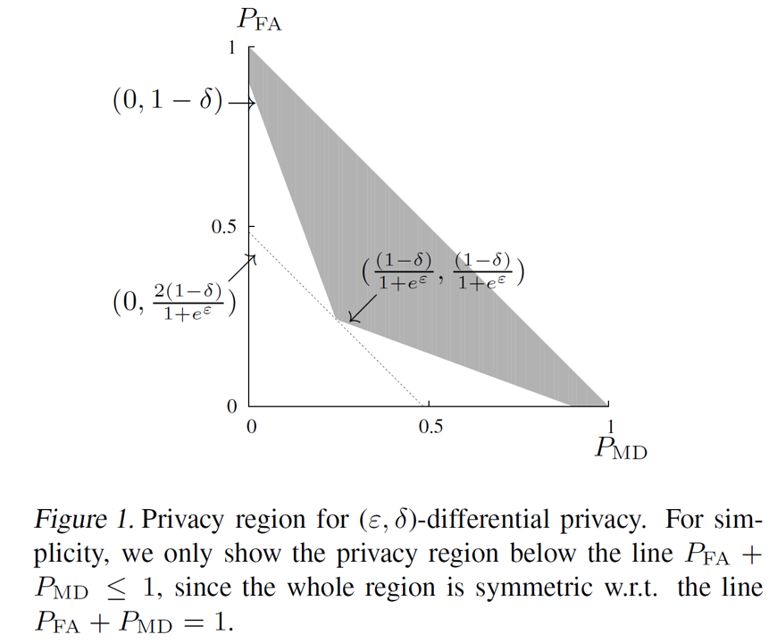

数据是人工智能的燃料，优秀的深度学习模型需要依靠大量高质量数据集进行训练。然而，随着模型精度的不断提升，对于个人隐私的泄露现象也变得越发严重。此外，随着互联网企业的扩展，用户数据开始担任重要生产资料的角色，成为各大垄断企业的护城河。欧盟，作为反对互联网垄断的桥头堡，同时也作为隐私保护的急先锋，在2018年正式施行法案《通用数据保护条例》(General Data protection Regulation, GDPR)。GDPR主张个人对数据的四项权利，请求权，拒绝权，修正权和删除、遗忘权。请求权，即个人有权了解其个人数据是否被处理，哪些个人数据以怎样的方式被处理以及进行了哪些数据处理操作；拒绝权，即个人有令人信服的合法理由，可禁止进行某些数据处理操作，比如个人可拒绝以营销为目的的个人数据处理。遗忘权，即个人有权寻求删除其个人数据的影响，比如用个人的微博，抖音数据训练的推荐算法，能够把个人的影响给忘掉。此外，GDPR还对数据的传输有明确的要求，比如欧盟境内的数据不得在境外被使用。

那么，一个自然的问题是，如何让人工智能模型的训练过程能够符合数据保护条例，保护个人隐私呢？依据GDPR的要求，首先数据的存储必须满足去中心化，而模型则需要在去中心化的数据库上进行分布式训练。联邦学习[1]是应对这种要求的解决方案，它允许模型在本地数据库上训练，并构建一个全局的调度器，通过对不同本地模型的更新进行汇总（即FedAvg算法），获得全局模型。得到的全局模型能够利用所有本地数据的信息，并得到更好的模型精度。其次，GDPR要求个人能够控制其数据对于模型的影响。人工智能模型是通过归纳所有数据信息构建的，它的输出结果是否会泄露个人隐私呢？差分隐私（Differential Privacy)[2]系统地探讨并解决了这一问题。在本篇Blog中，我们对应用于深度学习中的差分隐私技术进行入门式的介绍，包括差分隐私的动机与定义，满足差分隐私要求的梯度下降方法，以及如何对差分隐私的隐私保护程度进行计算。因为我们的主要目的是将差分隐私应用于隐私保护场景，而非对差分隐私进行研究，在本篇Blog中我们会略过一些数学证明的过程，将重心聚焦到差分隐私的应用上。

## 差分隐私的动机，背景以及基本定义

### 隐私的基本定义

在讨论差分隐私之前，我们先对“什么是隐私”这一问题进行讨论。在不同的考量下，隐私的定义也不一样。目前普遍比较接受的定义是：“单个用户的某一些属性” 可以被看做是隐私。注意该说法所强调的是“单个用户”，也就是说，如果是一群用户的某一些属性，那么可以不看做隐私。譬如，医院发布调查报告说，抽烟的人会有更高几率得肺癌，这个不泄露任何隐私。但是如果医生说，张三因为抽烟，所以有x\%的概率得肺癌，这就是个人隐私的泄露。如果我们拥有一个数据库，那么对精确的个体信息的查询与检索都会泄露隐私，因此对于个人数据的加密是最基本的保护隐私策略。然而，就算我们对个人数据进行了加密，对一群用户的某些属性的查询，以及对查询结果进行加工与建模，也就是“数据分析”，往往也会泄露个人隐私。而相比于数据加密，对数据分析的过程进行隐私保护因其不对称性更加具有难点，因为数据加密过程中，解密者与攻击者往往是两方，但是数据分析的过程中，分析师与“隐私攻击者”则是一方。

我们先来举几个例子，看看什么样的数据分析行为会侵犯隐私，以及什么样的行为看似不会侵犯隐私，但是通过一连串叠加也会侵犯个人隐私。首先，在直觉上，如果查询的数据库特别大，而且我们规定只允许查询摘要形式的信息或者统计形式的信息，这种数据分析方法看起来保护了个人隐私。但是，如果我们知道某个个体的信息包含在数据库中，我们就可以利用一种叫差分攻击的方法得到个体的信息。比如，如果我们已知**X**的信息在某个大型医疗数据库中。那么我们可以查询：有多少人患血友病，以及条件查询，有多少个不叫**X**的人患白血病。这样经过差分，我们就得到了**X**是否患血友病的信息。对于这种情况，如果我们引入某种监督机制，比如有一个监督者禁止这种不安全的查询，或者有监督者在必要的时候对数据库进行匿名处理，似乎可以避免上述的差分攻击，是否有一个监督机制能保证数据分析过程中，隐私不被泄露吗？答案是没有，原因有二：(1) 禁止查询的决定本身也会带来隐私泄露。比如国家不公布第七次人口普查数据，或者从2006年开始不公布中国的基尼系数，这本身也有某些信息。(2) 可以将单次破坏隐私的查询拆分成一系列查询，而对于每次查询，很难判断是否破坏隐私。最后，由于数据分析师的先验知识背景非常多样，因此数据分析师的辅助信息也会将一些不破坏隐私的查询变得破坏隐私，这就带来了第二种隐私泄露的形式，即由于数据库之外的辅助信息带来的隐私泄露。比如我们知道邻居**X**在某一天去了医院，而我们得到的匿名医院数据库中，在这一天的数据条目特别少，那么**X**的个人信息也会以某种高概率泄露。比如作为**X**的邻居，我们发现他常常去买蛋糕。但是有一段时间他忽然开始买不含糖的面包了，如果我是一个医生，我可能会猜想他患了糖尿病，这就是辅助信息带来的隐私泄露。

综上所述，差分攻击与辅助信息是数据分析过程中隐私泄露的主要诱因，而引入监管也不能保证隐私。针对这种状况，差分隐私提出了一种数据分析过程的隐私保护定义，即**对于数据库数据的任何分析，以及根据分析结果与其他信息进行的进一步的合并加工，都不会泄露个人隐私。**

### 差分隐私的动机与基本形式

在上文中，我们对隐私进行了定性的定义。在应用过程中，隐私保护的目的则有更简单的具体描述：对于任何数据分析员，要求分析员在对数据库进行分析后，对数据库中每一个个体的了解不会超过其在分析开始之前的了解。那么，为了达成这种目的，我们需要对差分隐私提出两个疑问：对于一个数据分析过程，应当在什么时机，以什么方式引入并实现隐私保护机制呢？

在第一节对于侵犯隐私行为的讨论中，我们知道引入实时的监督者并不能保障个人隐私安全，因此差分隐私的引入时机必然是在数据库发布后，到所有的数据分析工作开始之前。因此，我们沿用[2]中的描述，对差分隐私所扮演的角色进行描述：差分隐私相当于一个值得信赖的数据库管理员，它的目的是保护数据库中每一行记录，同时允许整个数据库能够被分析。这个管理员在数据库面向分析员发布前，对原始数据库进行一些操作：对数据库进行合成（例如，依据原始数据产生同分布的虚拟数据）、对某些统计结果进行汇总，或者自行清除数据库某些离群数据，然后发布新的数据库，销毁原始数据库。此后，差分隐私不再发挥作用，对于新的数据库，允许数据分析员进行自适应的查询，包括根据当前的查询结果，以及分析员的先验知识，自行决定下一次查询。差分隐私希望经过这种操作后，对于任何可能的查询，以及对查询结果的一系列加工都不会泄露个体隐私。

那么，差分隐私将如何对原始数据库进行足以保护隐私的操作呢？[2]提出，要满足个体隐私保护的要求，引入随机性是必须的，因为如果每一次的查询都是精确查询，那么数据分析者可以通过差分查询，知道未知行中数据的价值。如何引入随机性呢？作为差分隐私的动机，[2]举了一个社会科学做敏感性问题调研的例子。假设我们想要调研一个敏感问题，如调查已婚人群中的出轨比率，那么让每一个被调研者如实回答问题必然导致个人隐私被侵犯。但是我们想要获取的是统计信息，而非每一个个体的信息，因此可以构建如下随机回答算法：令受访者自己抛一枚均匀硬币，如果正面朝上，那么如实回答问题，如果背面朝上，那么再抛一枚硬币，正面朝上回答是，背面朝上回答否。这样，对于受访者而言，无论他回答的结果如何都不会侵犯隐私，因为对于一个人而言至少有$$\frac{1}{4}$$的概率会回答“有出轨”，因此他的回答并不会透露真实的情况。而对于研究者而言，出轨比例$$p$$可以通过简单的计算得到：

$$
q= \frac{\text{回答是的人数}}{\text{总人数}}=\frac{p*\frac{1}{2}*\text{总人数}+\frac{1}{4}*\text{总人数}}{\text{总人数}};\\
p=2q-\frac{1}{2}
$$

基于这种方案，差分隐私要求对于任何查询，其输出都是概率的。在给出差分隐私的精确定义前，我们需要对随机算法进行一些定义。

**定义1. （概率单纯形）** 给定一个数目有限的离散集$$\mathcal{O}$$，我们可以将看$$\mathcal{O}$$作是有限数量的互斥事件，定义$$\mathcal{O}$$上的概率单纯形为$$\Delta(\mathcal{O})$$，满足
$$
\Delta(\mathcal{O})=\{\mathbf{x}\in\mathbb{R}^{\vert \mathcal{O}\vert}:x_i\geq0 \text{ and }\sum_{i=1}^{\vert \mathcal{O}\vert}x_i=1\}
$$

概率单纯形其实就是在事件集$$\mathcal{O}$$上所有可能的概率分布的集合，而每一个元素$$\mathbf{x}\in \Delta(\mathcal{O})$$就是一种可能的概率分布。基于**概率单纯形**，我们可以对随机算法进行如下的形式化定义：

**定义2.（随机算法）** 记数据库中所有条目的集合为$$\mathcal{X}$$，则所有可能的子数据库构成的空间为$$\mathbb{N}^{\vert \mathcal{X}\vert}$$。随机算法$$\mathcal{M}$$将一个子数据库$$D\in \mathbb{N}^{\vert \mathcal{X}\vert}$$映射到离散集合$$\mathcal{O}$$的概率单纯形的一个可能分布上，即

$$
\mathcal{M}:\mathbb{N}^{\vert \mathcal{X}\vert}\rightarrow \Delta(\mathcal{O})
$$

我们也称$$\mathcal{O}$$为随机算法$$\mathcal{M}$$的 **Range**，即$$\text{Range}(\mathcal{M})=\mathcal{O}$$。其中对于每一个可能作为算法输入的数据库$$D$$，随机算法$$\mathcal{M}$$先将其映射到一个概率分布，即对于任意$$D\in \mathbb{N}^{\vert \mathcal{X}\vert}$$，以及任意的$$o\in \mathcal{O}$$，随机算法$$\mathcal{M}(D)$$以$$(\mathcal{M}(D))_{o}$$的概率输出结果为$$o$$。

如何直观地理解**随机算法**呢？在数据分析过程中，**$$\mathcal{M}$$可以是某种模糊查询方法**。比如查询一群人的平均工资范围（如$$1k-2k,2k-3k,>3k$$），直接查询方法对输入的数据进行加和求均值，然后输出该均值对应的范围，而随机算法则是对均值再加一个噪声，然后输出加噪后结果对应的范围，这样如果工资均值是*1900*,噪声服从$$N(100,10)$$的正态分布，那么其回答将会大概以$$49.3\%$$的概率回答$$1k-2k$$，以$$50.7\%$$的概率回答剩下的选项。**$$\mathcal{M}$$还可以是从原始数据库到合成数据库的映射**，然后输出合成数据库中的查询结果，比如对原始数据库中的工资水平构建分布模型，然后从分布中采样生成相同大小的新数据库，并输出新数据库中的结果；**$$\mathcal{M}$$也可以是一系列输出为概率分布的机器学习算法**，以机器学习中的图像分类问题为例，此时$$\mathcal{M}$$通过带标注的图像数据库$$D$$进行训练，并对未知的图像进行预测，预测结果为分类概率。

有了随机算法，我们还需要定义数据库之间的距离。一般用$$l_1\text{-norm}$$表示数据库之间的距离。对于两个数据库 $$D,D'\in \mathbb{N}^{\vert \mathcal{X}\vert}$$，我们定义它们的$$l_1$$距离$$\Vert D-D'\Vert _1$$为两个**Database**中不同的记录的个数。如果$$\Vert D-D'\Vert _1=1$$，我们就称$$D,D'$$为相邻数据集（**Neighboring Datasets**），此时$$D,D'$$只相差一个记录。差分隐私可以直观理解为，对于两个相似的**Database**，要求随机算法$$\mathcal{M}$$在两个**Database**上的表现也相似，它的形式化定义如下：

**定义3.（差分隐私）** 我们称$$\mathbb{N}^{\vert \mathcal{X}\vert}$$上的随机算法$$\mathcal{M}$$满足$$(\epsilon,\delta)\text{-differentially private}$$，如果对于所有的随机事件$$\mathcal{S}\subset \mathcal{O}$$，以及对于所有的相邻数据库$$D,D'\in \mathbb{N}^{\vert \mathcal{X}\vert}$$，满足

$$
\text{Pr}[\mathcal{M}(D)\in \mathcal{S}]\leq \exp(\epsilon)\text{Pr}[\mathcal{M}(D')\in \mathcal{S}]+\delta \tag{1}
$$

其中，如果$$\delta=0$$，我们就称随机算法$$\mathcal{M}$$满足$$\epsilon\text{-differentially private}$$。

### 差分隐私的直观理解：假设检验与效用函数

如何直观理解差分隐私呢？我们沿用文献[2,3]的思路，从假设检验与效用函数两个角度对差分隐私的定义进行分析。从式$$(1)$$中我们可以有一种印象，差分隐私要求每一条个人记录在所有的查询情况下，对于查询结果的影响都不能太大。换句话说，我们要求随机算法$$\mathcal{M}$$对于任意相邻数据集，都不能根据输出结果明确区分出这两个数据集，而这就是假设检验的方法。

对于随机算法$$\mathcal{M}$$的任意输出$$Y$$，选择数据库$$D$$为原假设，选择$$D'$$为备择假设，我们可以将其进行形式化如下：

$$
H_0:Y \text{ came from D, i.e. }Y=\mathcal{M}(D)\\
H_1:Y \text{ came from D', i.e. }Y=\mathcal{M}(D')
$$

将随机事件$$\mathcal{S}\subset \mathcal{O}$$看成是拒绝域，那么假设检验的第一类错误，即本应接受原假设但是拒绝的拒真错误（false alarm），其发生概率为$$P_{\text{FA}}(D,D',\mathcal{M},\mathcal{S})=\text{Pr}[\mathcal{M}(D)\in \mathcal{S}]$$，而假设检验的第二类错误，即本应拒绝原假设但是接受的存伪错误（missed detection)，其发生概率为$$P_{\text{MD}}(D,D',\mathcal{M},\mathcal{S})=\text{Pr}[\mathcal{M}(D’)\in \mathcal{O}-\mathcal{S}]$$（即如果拒绝原假设，那么实际上$$Y=\mathcal{M}(D')$$，而因为接受了原假设，说明该概率落在接受域$$\mathcal{O}-\mathcal{S}$$中）。利用第一类错误与第二类错误，我们可以得到如下差分隐私的等价假设检验形式：

**定理1.（差分隐私的假设检验等价）** $$\forall \epsilon\geq 0,\delta\in[0,1]$$,随机算法$$\mathcal{M}$$满足$$(\epsilon,\delta)\text{-differentially private}$$当且仅当对于所有相邻数据库$$D,D'\in \mathbb{N}^{\vert \mathcal{X}\vert}$$，以及任意拒绝域$$\mathcal{S}\subset \mathcal{O}$$，满足
$$
P_{\text{FA}}(D,D',\mathcal{M},\mathcal{S})+\exp(\epsilon)P_{\text{MD}}(D,D',\mathcal{M},\mathcal{S})\geq1-\delta\\
\exp(\epsilon)P_{\text{FA}}(D,D',\mathcal{M},\mathcal{S})+P_{\text{MD}}(D,D',\mathcal{M},\mathcal{S})\geq1-\delta
$$

证明：

用差分隐私的基本性质，写出下面四条等式即可。

$$
\text{Pr}[\mathcal{M}(D)\in \mathcal{O}-\mathcal{S}]\leq e^{\epsilon}\text{Pr}[\mathcal{M}(D')\in \mathcal{O}-\mathcal{S}]+\delta\\
\text{Pr}[\mathcal{M}(D')\in \mathcal{S}]\leq e^{\epsilon}\text{Pr}[\mathcal{M}(D)\in \mathcal{S}]+\delta\\
\text{Pr}[\mathcal{M}(D)\in \mathcal{O}-\mathcal{S}]=1-P_{\text{FA}}(D,D',\mathcal{M},\mathcal{S})\\
\text{Pr}[\mathcal{M}(D')\in \mathcal{S}]=1-P_{\text{MD}}(D,D',\mathcal{M},\mathcal{S})
$$

利用该等价形式，我们可以分别以$$P_{\text{FA}}$$，$$P_{\text{MD}}$$为坐标轴，画出差分隐私的可行隐私域

$$
\mathcal{R}(\epsilon,\delta)=\{(P_{\text{FA}},P_{\text{MD}})\vert P_{\text{FA}}(D,D',\mathcal{M},\mathcal{S})+e^{\epsilon}P_{\text{MD}}(D,D',\mathcal{M},\mathcal{S})\geq 1-\delta,\\e^{\epsilon}P_{\text{FA}}(D,D',\mathcal{M},\mathcal{S})+P_{\text{MD}}(D,D',\mathcal{M},\mathcal{S})\geq 1-\delta\}
$$

如下图所示。

通过以上等价形式的推导，我们从假设检验的角度对差分隐私进行了解释，得到了一个基本的直觉：差分隐私就是要求对于任意的相邻数据库，数据分析者无法仅通过输出结果对它们进行显著的区分。那么，这种“无法区分”的性质会带来什么好处呢？我们可以从效用函数的角度对该问题进行探讨。

考虑数据库$$D$$中的某个个体$$i$$，我们记他在未来所有可能经历的事件集合为$$\Omega$$（譬如考研是否成功，就业是否顺利等），对于每一个事件，我们都可以认为该事件对于个体个体$$i$$具有某种可以量化的影响，也就是效用函数。我们记所有可能事件的效用函数为

$$
u_i:\Omega\rightarrow \mathbb{R}_{\geq 0}
$$

对于满足$$(\epsilon,0)\text{-differentially private}$$的随机算法$$\mathcal{M}$$，数据分析者可以用它进行一次分析行为，记为$$\mathcal{M}(D)$$，如果这种分析行为会影响到个体的信息，也就是泄露了隐私，那么就会对未来的事件产生影响。例如，如果某个犯罪记录数据库泄露了，那么对该数据库的查询就可能会影响个体事业，我们记由于随机算法的查询$$\mathcal{M}(D)$$所导致的事件分布为$$f(\mathcal{M}(D))$$，所对应的概率分布为$$\text{Pr}_{f(\mathcal{M}(D))}[\omega],\omega\in \Omega$$，此时个体$$i$$的期望效用为

$$
\mathbb{E}_{\omega\sim f(\mathcal{M}(D))}[u_i(\omega)]=\sum_{\omega\in\Omega}u_i(\omega)\cdot\text{Pr}_{f(\mathcal{M}(D))}[\omega]
$$

此外，我们记除去个体$$i$$后所得数据库为$$D'$$，在这种情况下，由于个体并未参加数据分析的过程，因此个人隐私并未泄露，我们可以以此时的效用函数作为零隐私泄露的基准。通过同样的方法，我们计算通过相邻数据库$$D'$$的分析对于个体$$i$$的期望效用如下

$$
\mathbb{E}_{\omega\sim f(\mathcal{M}(D'))}[u_i(\omega)]==\sum_{\omega\in\Omega}u_i(\omega)\cdot\text{Pr}_{f(\mathcal{M}(D'))}[\omega]
$$

利用差分隐私性质，我们有

$$
\text{Pr}_{f(\mathcal{M}(D))}[\omega]\leq e^{\epsilon}\cdot\text{Pr}_{f(\mathcal{M}(D'))}[\omega]\\\text{Pr}_{f(\mathcal{M}(D'))}[\omega]\leq e^{\epsilon}\cdot\text{Pr}_{f(\mathcal{M}(D))}[\omega]
$$

因此可以得到

$$
e^{-\epsilon}\cdot \mathbb{E}_{\omega\sim f(\mathcal{M}(D'))}[u_i(\omega)] \leq\mathbb{E}_{\omega\sim f(\mathcal{M}(D))}[u_i(\omega)]\leq e^{\epsilon}\cdot \mathbb{E}_{\omega\sim f(\mathcal{M}(D'))}[u_i(\omega)]
$$

当$$\epsilon\rightarrow 0$$，我们利用极限$$e^\epsilon\approx (1+\epsilon)$$，可以得到当个体$$i$$参与数据分析过程与从未参数数据分析过程的效用函数在差分隐私约束下的关系：

$$
(1-\epsilon)\cdot \mathbb{E}_{\omega\sim f(\mathcal{M}(D'))}[u_i(\omega)] \leq\mathbb{E}_{\omega\sim f(\mathcal{M}(D))}[u_i(\omega)]\leq (1+\epsilon)\cdot \mathbb{E}_{\omega\sim f(\mathcal{M}(D'))}[u_i(\omega)] \tag{2}
$$

通过$$(2)$$式，我们可以从效用函数的角度理解差分隐私：虽然贡献自己的数据可能确实会导致自己面临一些伤害，但差分隐私保证了这种伤害的后果是可控的，个人的效用函数不会因他们的数据参与分析而显著增加。这种性质是非常实用的，因为数据的提供者往往无法控制数据库的其他内容，如果我们对隐私保护不加限制，那么个人对于自己的数据信息对自己可能造成的结果是未知的。而有了差分隐私，任何数据分析师都可以保证，对于任意的效用函数，个体预期的未来效用不会受到超过$$\epsilon$$水平的损害。当个人决定是否贡献自己的数据用于数据分析时，他们可以根据$$\epsilon$$的值来量化可能的损失，通过比较分享数据获得的激励，可以决定是否共享数据。

### 差分隐私的基本性质：传递性与群体隐私

差分隐私是一个强大的隐私保护工具，但是要实现强差分隐私约束（即$$\epsilon,\delta\rightarrow 0$$）往往需要增加大量噪声。一般而言，数据的分析包括多个环节，如果在每个环节上都满足差分隐私约束，势必会令数据分析结果失真。差分隐私的传递性给出了一个强有力的断言：只要在数据分析的任何一个环节，随机算法$$\mathcal{M}$$满足$$(\epsilon,0)\text{-differentially private}$$，那么在仅用该环节的结果作为输入的任意之后的数据处理过程都满足$$(\epsilon,0)\text{-differentially private}$$，这就是差分隐私的传递性（Post-Processing）。

**引理1.（差分隐私的传递性）**令$$\mathcal{M}:\mathbb{N}^{\vert \mathcal{X}\vert}\rightarrow \Delta(\mathcal{O})$$是一个满足$$(\epsilon,\delta)\text{-differentially private}$$ 的随机算法，令$$f:\Delta(\mathcal{O})\rightarrow \Delta(\mathcal{A})$$是一个任意的随机映射，那么随机算法$$f\circ \mathcal{M}:\mathbb{N}^{\vert \mathcal{X}\vert}\rightarrow \Delta(\mathcal{A})$$也满足$$(\epsilon,\delta)\text{-differentially private}$$。

证明过程很简单，选择一个子集$$\mathcal{P}\subset \mathcal{A}$$，令$$\mathcal{T}=\{\mathcal{o}\in\mathcal{O}:f(\mathcal{o})\in P\}$$是映射到该子集的所有事件，那么
$$
\text{Pr}[f(\mathcal{M(D)})\in \mathcal{P}]=\text{Pr}[\mathcal{M(D)}\in \mathcal{T}]\\
\leq e^{\epsilon}\cdot \text{Pr}[\mathcal{M(D')}\in \mathcal{T}]+\delta\\
=e^{\epsilon}\cdot \text{Pr}[f(\mathcal{M(D')})\in \mathcal{P}]+\delta
$$
此外，注意到在之前的差分隐私都要求相邻数据库，即数据库$$D,D'$$之间往往只相差一个条目。但是，实践过程中数据往往是呈团、簇结构，也就是具有*Data Group*的性质。此时，我们有以下定理：

**定理2.（群差分隐私）**令$$\mathcal{M}:\mathbb{N}^{\vert \mathcal{X}\vert}\rightarrow \Delta(\mathcal{O})$$是一个满足$$(\epsilon,0)\text{-differentially private}$$ 的随机算法，令数据库$$D,D'$$仅仅相差$$k$$个条目，即$$\Vert D-D'\Vert_1=k$$，那么，对于这种$$k$$-相邻数据库，随机算法$$\mathcal{M}$$满足$$(k\epsilon,0)\text{-differentially private}$$。

该定理的证明过程是显然的，特别地，对于$$(\epsilon,0)\text{-differentially private}$$，对于$$k$$-相邻数据库满足$$(k\epsilon,ke^{(k-1)\epsilon}\delta)\text{-differentially private}$$。

### 差分隐私的优势与局限性

## References
[1] Konečný J, McMahan B, Ramage D. Federated optimization: Distributed optimization beyond the datacenter[J]. arXiv preprint arXiv:1511.03575, 2015.

[2] Dwork C, Roth A. The algorithmic foundations of differential privacy[J]. Foundations and Trends in Theoretical Computer Science, 2014, 9(3-4): 211-407.

[3] Kairouz P, Oh S, Viswanath P. The composition theorem for differential privacy[C]//International conference on machine learning. PMLR, 2015: 1376-1385.